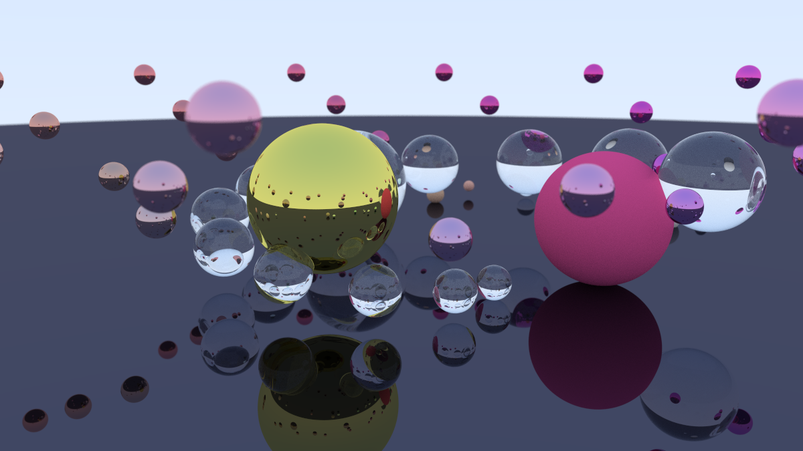
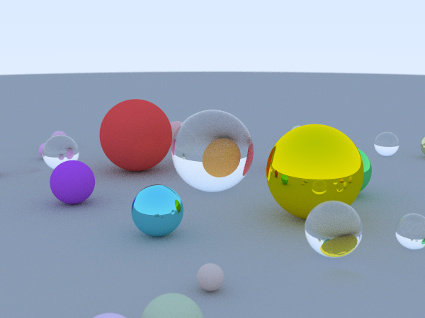
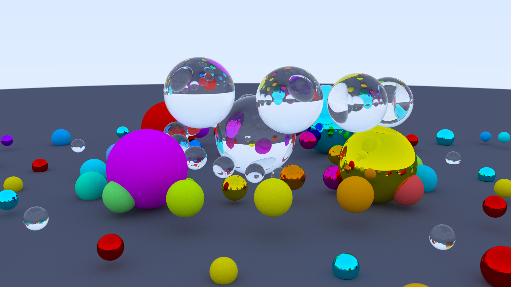
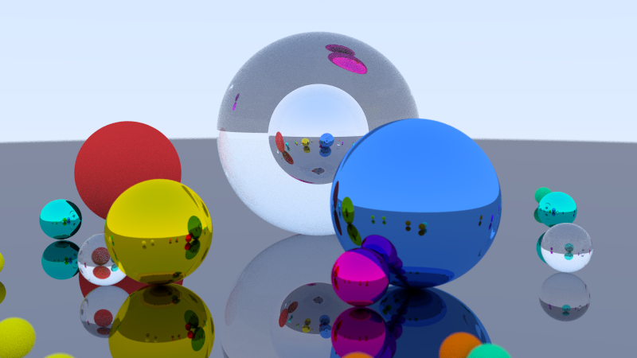

# Path Tracer

A Monte Carlo path tracer written in C++ from scratch, implementing physically-based rendering with support for multiple material types and camera effects. Currently working on CUDA support.

<table>
  <tr>
    <td></td>
    <td></td>
  </tr>
  <tr>
    <td></td>
    <td></td>
  </tr>
</table>

## Features

- **Materials**
  - Lambertian (diffuse) - matte surfaces with realistic light scattering
  - Metal - reflective surfaces with configurable fuzziness
  - Dielectric (glass) - refractive materials with Schlick approximation

- **Camera**
  - Configurable field of view and aspect ratio
  - Depth of field (defocus blur)
  - Flexible positioning with look-at targeting

- **Rendering**
  - Anti-aliasing via multi-sample per pixel
  - Gamma correction
  - Recursive ray bouncing for realistic reflections/refractions

## Building

Requires CMake 3.10+ and a C++11 compatible compiler.

```bash
mkdir -p build && cd build
cmake ..
make
```

## Usage

The path tracer outputs PPM format to stdout:

```bash
./build/main > image.ppm
```

Convert to PNG using ImageMagick:

```bash
convert image.ppm image.png
```

Or all at once:

```bash
make -C build && ./build/main > image.ppm && convert image.ppm image.png
```

## Project Structure

```
├── src/
│   └── main.cpp          # Scene setup and render entry point
├── include/
│   ├── camera.hpp        # Camera model and ray generation
│   ├── material.hpp      # Material definitions
│   ├── sphere.hpp        # Sphere primitive
│   ├── hittable.hpp      # Abstract geometry interface
│   ├── hittable_list.hpp # Scene container
│   ├── vec3.hpp          # 3D vector math
│   ├── ray.hpp           # Ray representation
│   ├── color.hpp         # Color utilities
│   ├── interval.hpp      # Range helper class
│   └── common.hpp        # Shared constants and utilities
└── CMakeLists.txt
```

## Acknowledgements

Based on [_Ray Tracing in One Weekend_](https://raytracing.github.io/books/RayTracingInOneWeekend.html) 

---

<sub>**License:** MIT © 2025 Lucas Cogrossi</sub>
